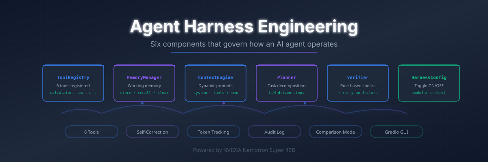
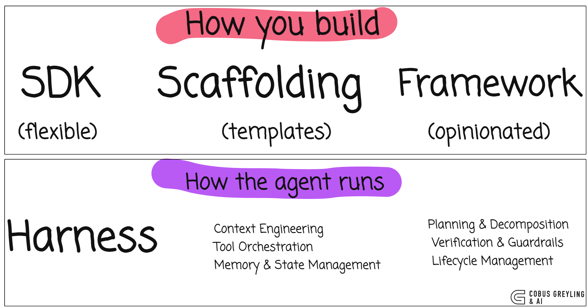
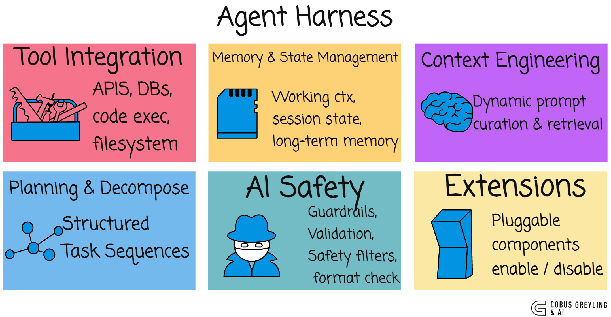
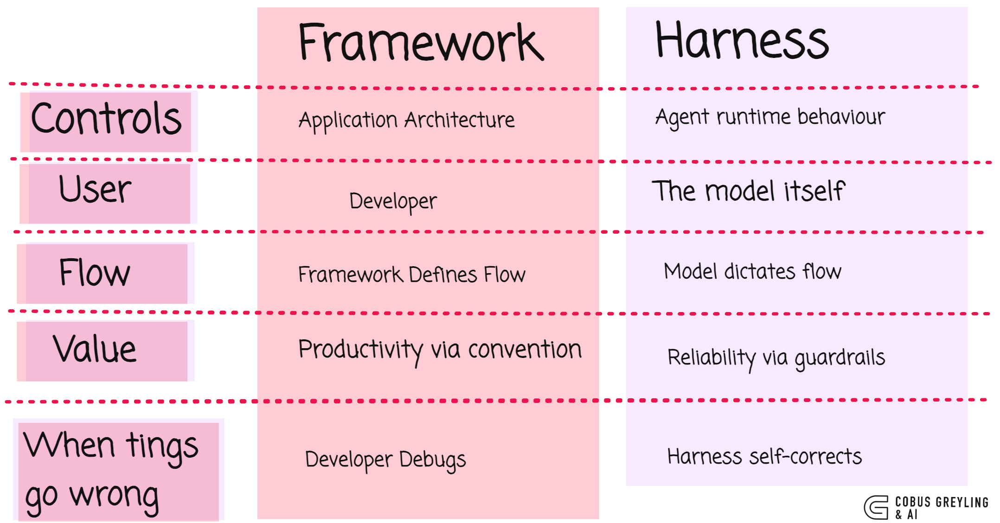
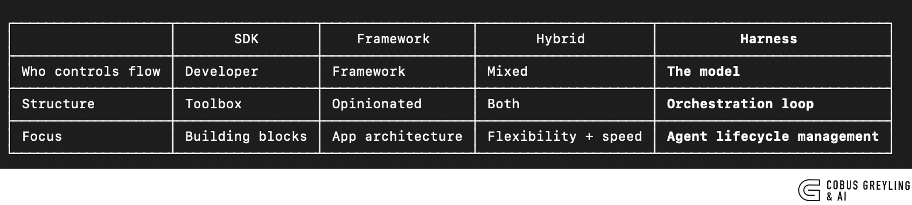

# AI Harness Engineering



A **harness** is the software system that governs how an AI Agent operates. It manages tools, memory, retries, context engineering and verification so the model can focus on reasoning.

This repo is a complete, working implementation of all six harness components — plus advanced features like guardrails, budget enforcement, sub-agents, and persistent memory — both as a CLI demo and a Gradio GUI, powered by **NVIDIA Nemotron Super 49B**.



---

## What's Inside

| File | Description |
|------|-------------|
| `harness_core.py` | Shared module — all components, tools, configs, and the main `Harness` class |
| `harness-demo.py` | CLI agent with 9 tools, retry loop, token tracking, YAML configs, and comparison mode |
| `harness-gui.py` | Gradio GUI with five tabs: Run Task, Compare Configs, Audit Log, Observability, Replay |
| `configs/` | YAML config presets (autonomous, conservative, minimal, guardrails, budget-limited) |
| `harness-engineering-blog.md` | The full blog post on harness engineering |

---

## The Six Harness Components



| # | Component | Class | Role |
|---|-----------|-------|------|
| 1 | Tool Integration | `ToolRegistry` | Register and execute 9 tools with risk levels |
| 2 | Memory & State | `MemoryManager` | Key-value working memory with optional SQLite persistence |
| 3 | Context Engineering | `ContextEngine` | Dynamically assembles system prompt + tool descriptions + memory + retry feedback + guardrail instructions |
| 4 | Planning | `Planner` | LLM call to decompose a complex task into discrete steps |
| 5 | Verification | `Verifier` + `Guardrails` | Rule-based checks + PII detection, toxicity filtering, code injection prevention |
| 6 | Modularity | `HarnessConfig` | Toggle any component ON/OFF, load from YAML presets |

---

## Features



### Core
- **9 Tools** — calculator, get_current_time, reverse_string, web_search, read_file, word_count, json_extract, text_summarize, code_execute
- **10 Diverse Example Tasks** — multi-step math, web search + calculation, file analysis, multi-tool chains, research + memory recall, JSON extraction, error log analysis, code execution, multi-source research, config audit
- **Retry / Self-Correction** — failed verification triggers automatic retry with feedback injection (configurable max retries)
- **Token Tracking** — input/output token counts per LLM call with running totals

### Advanced
- **Token Budget Enforcement** — set a maximum token budget; harness warns at 80% and stops at 100%
- **Advanced Guardrails** — PII detection (email, phone, SSN, credit card, IP), toxicity keyword filtering, response length limits, code injection prevention
- **Human-in-the-Loop Approval** — high-risk tools require approval before execution
- **Persistent Memory (SQLite)** — memory persists across sessions with SQLite backend
- **Sub-Agent Spawning** — delegate tasks to specialist sub-agents (researcher, analyst, writer)
- **YAML Config Presets** — load harness configurations from YAML files
- **Rate Limiting** — per-tool rate limiting to prevent runaway loops
- **Tool Risk Levels** — each tool tagged as low/medium/high risk

### Observability
- **Structured Audit Log** — every LLM call, tool execution, verification, guardrail check, memory store, and retry recorded as timestamped JSON
- **Replay / Time-Travel Debugging** — step-by-step replay trace of every event in execution
- **Observability Dashboard** — execution metrics, token breakdown, and event timeline in the GUI
- **Comparison Mode** — run the same task with 6 different harness configs (All ON, No Planner, No Verifier, No Memory, With Guardrails, Budget Limited) and compare side-by-side

---

## Architecture



```
User Task → Planner decomposes → For each step:
  ContextEngine builds prompt (system + tools + memory + retry feedback + guardrails)
    → Budget check → LLM call → Tool calls executed
      → Rate limit check → Human approval (if high risk)
        → Guardrail checks on output → Verifier checks → retry if failed
          → MemoryManager stores result (RAM or SQLite)
  → TokenTracker records usage (warns at 80% budget)
  → AuditLog records event (with replay trace)
→ Final answer with stats + token breakdown + audit trail
```

---

## YAML Config Presets

Five ready-to-use configurations in `configs/`:

| Preset | Description |
|--------|-------------|
| `autonomous.yaml` | All features on, sub-agents enabled, 3 retries |
| `conservative.yaml` | Guardrails + persistent memory + human approval, 5000 token budget |
| `minimal.yaml` | Tools only, no planner/verifier/memory — raw LLM + tools |
| `guardrails.yaml` | Standard features + guardrails enabled |
| `budget-limited.yaml` | Standard features with 2000 token budget cap |

Load via CLI:
```bash
python3 harness-demo.py --config configs/conservative.yaml
python3 harness-demo.py --list-configs
```

---

## Quick Start

```bash
# Clone
git clone https://github.com/cobusgreyling/ai_harness_engineering.git
cd ai_harness_engineering

# Setup
export NVIDIA_API_KEY="your-key"
pip install -r requirements.txt

# CLI demo
python3 harness-demo.py                          # Run default task
python3 harness-demo.py --task 2                  # Run task 2 (file analysis)
python3 harness-demo.py --all                     # Run all 10 tasks
python3 harness-demo.py --compare                 # Compare harness configs
python3 harness-demo.py --compare 1               # Compare on a specific task
python3 harness-demo.py --config configs/guardrails.yaml  # Use YAML config

# GUI
python3 harness-gui.py

# Docker
docker build -t harness-gui .
docker run -e NVIDIA_API_KEY=$NVIDIA_API_KEY -p 7860:7860 harness-gui
```

---

## CLI Output

```
============================================================
  HARNESS DEMO — Nemotron Super 49B
============================================================

[CONFIG      ] Tools: ON | Memory: ON | Planner: ON | Verifier: ON | Retry: ON | Guardrails: OFF
[TASK        ] "What is 47 * 83? Then find the square root..."
[TOOLS       ] 9 registered: calculator, get_current_time, reverse_string, web_search, read_file, word_count, json_extract, text_summarize, code_execute

[PLANNER     ] Decomposed into 3 steps:
               1. Calculate 47 * 83
               2. Compute the square root of the product
               3. Summarise both results

[STEP 1/3    ] Calculate 47 * 83
[TOOL        ] calculator("47 * 83") = 3901
[VERIFY      ] ✓ Non-empty response
[MEMORY      ] Stored: step_1_result = 3901

[STEP 2/3    ] Compute the square root of the product
[TOOL        ] calculator("3901**0.5") = 62.457985878508765
[VERIFY      ] ✓ Non-empty response
[MEMORY      ] Stored: step_2_result = 62.457985878508765

[STEP 3/3    ] Summarise both results
[VERIFY      ] ✓ Non-empty response

============================================================
  FINAL ANSWER
============================================================
  47 × 83 = 3901, and √3901 ≈ 62.46.

============================================================
  TOKEN USAGE
============================================================
  Call 1 (planner): 85 in + 42 out = 127
  Call 2 (step_1): 310 in + 28 out = 338
  Call 3 (step_2): 335 in + 31 out = 366
  Call 4 (step_3): 380 in + 35 out = 415
  TOTAL: 1110 in + 136 out = 1246 tokens across 4 calls
```

---

## GUI

The Gradio interface has five tabs:

1. **Run Task** — configure all harness components (core + advanced), select an example task or write your own, view execution log + final answer + memory + stats + token usage
2. **Compare Configs** — run the same task across 6 configurations and see a summary table
3. **Audit Log** — generate and view the full structured JSON audit trail
4. **Observability** — execution metrics, token breakdown, guardrail results, and event timeline
5. **Replay** — step-by-step time-travel replay trace of every execution event

Launch with `python3 harness-gui.py` and open the URL shown in terminal.

---

## The Nine Tools

| Tool | Risk | Description |
|------|------|-------------|
| `calculator` | Low | Evaluate math expressions (supports sqrt, sin, cos, log, pi, e) |
| `get_current_time` | Low | Return current date and time |
| `reverse_string` | Low | Reverse a string |
| `web_search` | Low | Simulated web search with 12 topics |
| `read_file` | Medium | Read simulated files (config.yaml, metrics.csv, notes.txt, users.json, errors.log) |
| `word_count` | Low | Count words, characters, and lines |
| `json_extract` | Low | Extract values from JSON by key |
| `text_summarize` | Low | AI-powered text summarization via LLM |
| `code_execute` | High | Sandboxed Python code execution |

---

## Environment Variables

| Variable | Required | Description |
|----------|----------|-------------|
| `NVIDIA_API_KEY` | Yes | Your NVIDIA NIM API key |

Create a `.env` file (see `.env.example`) or export directly:
```bash
export NVIDIA_API_KEY="your-key"
```

---

## Author

Cobus Greyling
